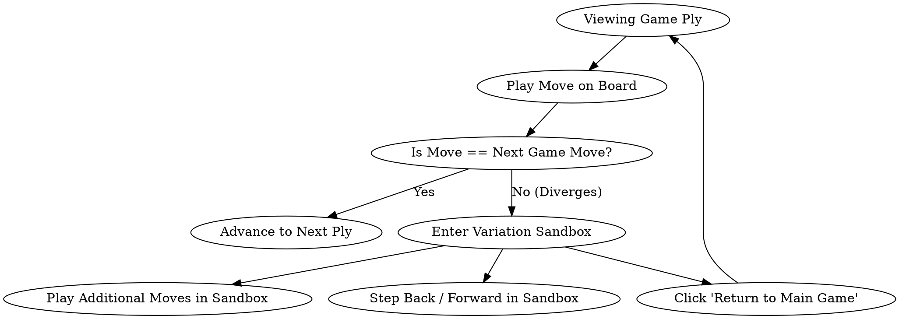
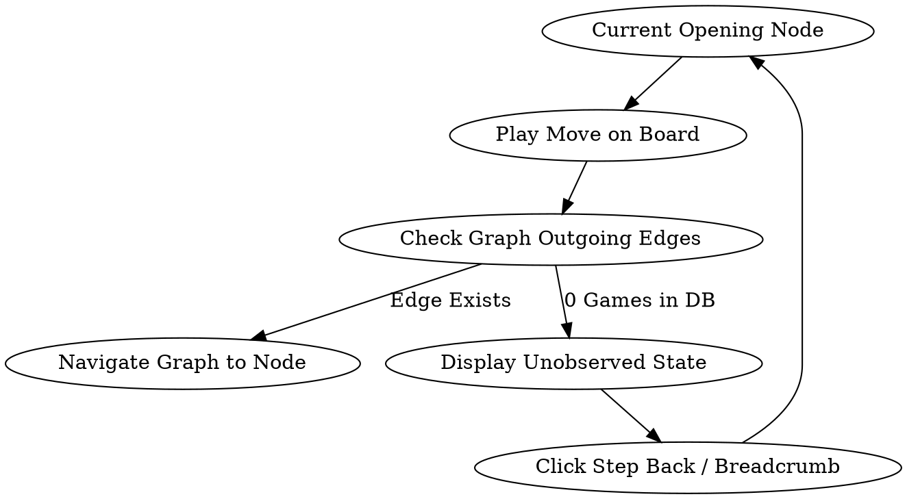

# Design Specification: Gameplay Analysis & Interactive Chessboard

- **Date**: 2026-08-14
- **Topic**: Chess.com-Style Move Analysis, Destination Badges, & Free Board Movement
- **Status**: Validated Design

---

## 1. Executive Summary & Goals

This specification defines the design and architecture for:

1. **Chess.com-Style Move Classification & Badges**: Expanding move-quality evaluation to include **Brilliant (`!!`)**, **Great Move (`!`)**, **Best Move (`★`)**, **Excellent (`✓✓`)**, **Good (`✓`)**, **Book (`📖`)**, **Inaccuracy (`?!`)**, **Mistake (`?`)**, **Blunder (`??`)**, **Missed Win (`✕`)**, and **Forced Move (`□`)**.
2. **On-Board Destination Badges & Review Summary**: Displaying visual badge glyphs on the destination square where pieces land and presenting a minimalist, side-by-side Game Review breakdown card with player accuracy percentages and category counts.
3. **Interactive Board (Drag-and-Drop & Click-to-Move)**: Leveraging `react-chessboard` (with React 19 compatibility) to enable drag-and-drop piece movement, click-to-move square selection with legal target dot indicators, and pawn promotion dialogs.
4. **Analysis Variation Sandbox**: Allowing users to freely play alternative moves off any game position, creating a local variation line with breadcrumbs, step controls, and a "Return to Game" button.
5. **Opening Tree Interactive Exploration**: Enabling users to play moves directly on the board to navigate the opening graph, with clear visual handling for unobserved novelty moves (0 games in database).

---

## 2. Move Classification Heuristics & Formulas

The classification model analyzes the position before and after each move, evaluating win probability changes, material sacrifices, and candidate move alternatives.

### 2.1 Quality Categories & Rules

| Category       | Badge Symbol | Theme Color                  | Classification Rules                                                                                                                                                                                                                                             |
| -------------- | ------------ | ---------------------------- | ---------------------------------------------------------------------------------------------------------------------------------------------------------------------------------------------------------------------------------------------------------------- |
| **Brilliant**  | `!!`         | Cyan / Teal (`#00b4d8`)      | **Material Sacrifice**: Mover places a piece en prise or exchanges down in piece value where: <br>1. Move is the engine's best move (or within 0.02 win-prob loss). <br>2. Win probability after the move is $\ge 50\%$. <br>3. Win probability loss $\le 0.02$. |
| **Great Move** | `!`          | Blue (`#2196f3`)             | **Critical / Only Move**: Sharp tactical position where the played move preserves the advantage (win prob loss $\le 0.02$), but the 2nd best alternative loses $\ge 0.15$ win probability.                                                                       |
| **Best Move**  | `★`          | Green (`#22c55e`)            | The top engine move with win probability loss $0.00$ (and not classified as Brilliant/Great/Book/Forced).                                                                                                                                                        |
| **Excellent**  | `✓✓`         | Light Green (`#4ade80`)      | Very strong move with minimal win probability loss ($0 < \text{loss} \le 0.02$).                                                                                                                                                                                 |
| **Good**       | `✓`          | Mint / Olive (`#86efac`)     | Solid move with minor win probability loss ($0.02 < \text{loss} \le 0.05$).                                                                                                                                                                                      |
| **Book**       | `📖`         | Sepia / Brown (`#b08968`)    | Move exists in the player's ingested opening graph or standard theoretical opening database.                                                                                                                                                                     |
| **Inaccuracy** | `?!`         | Yellow (`#eab308`)           | Minor positional slip with win probability loss ($0.05 < \text{loss} \le 0.10$).                                                                                                                                                                                 |
| **Mistake**    | `?`          | Orange (`#f97316`)           | Significant mistake with win probability loss ($0.10 < \text{loss} \le 0.20$).                                                                                                                                                                                   |
| **Blunder**    | `??`         | Red (`#ef4444`)              | Severe blunder with win probability loss $> 0.20$ or move that concedes forced mate to the opponent.                                                                                                                                                             |
| **Miss**       | `✕`          | Magenta / Purple (`#d946ef`) | Missed an immediate winning tactic or forced mate: win probability before was $\ge 85\%$ or forced mate, but dropped significantly ($> 0.15$ loss).                                                                                                              |
| **Forced**     | `□`          | Slate Gray (`#64748b`)       | The position had only $1$ legal move available (e.g. king check with a single legal square).                                                                                                                                                                     |

### 2.2 Win Probability Loss Formula

Win probability $P \in [0, 1]$ is calculated using the logistic formula:
$$P(\text{score}) = \frac{1}{1 + 10^{-\text{cp} / 400}}$$
The win probability loss for mover $M$ between positions before and after the move is:
$$\text{Loss} = \max(0, P(\text{score}_{\text{before}}, M) - P(\text{score}_{\text{after}}, M))$$

### 2.3 Game Review Summary Aggregation

For each game analysis, the summary calculates:

- **White & Black Accuracy Scores**: Mean accuracy percentage across eligible moves.
- **Move Breakdown Map**: `{ brilliant, great, best, excellent, good, book, inaccuracy, mistake, blunder, miss, forced }` for White and Black.

---

## 3. Component Architecture & Library Integration

### 3.1 Component Hierarchy

```
src/
├── components/
│   ├── board/
│   │   ├── InteractiveChessboard.tsx      // react-chessboard wrapper with badges, dots, arrows
│   │   ├── MoveClassificationBadge.tsx   // Crisp SVG badge glyph component
│   │   ├── PromotionDialog.tsx           // Pawn promotion picker overlay (Q/R/B/N)
│   │   ├── EvaluationBar.tsx             // Existing vertical evaluation bar
│   │   └── MoveHistoryControls.tsx       // History stepping buttons (|<, <, >, >|)
│   ├── analysis/
│   │   ├── AnalyzerWorkspace.tsx         // Main analysis panel
│   │   ├── GameReviewSummaryCard.tsx     // Minimalist White vs Black breakdown table & accuracy
│   │   ├── VariationSandboxBanner.tsx    // Sandbox line breadcrumbs and "Return to Game" button
│   │   ├── MoveAccuracyGraph.tsx         // Evaluation curve graph
│   │   └── EngineAnnotationPanel.tsx     // Ply details and principal variations
│   ├── tree/
│   │   ├── OpeningTreeTable.tsx          // Candidate moves table
│   │   └── PathBreadcrumbs.tsx           // Opening move path breadcrumbs
│   └── workspace/
│       └── ChessWorkspace.tsx            // Orchestrates active tab, board state, and variations
```

### 3.2 `react-chessboard` Integration Details

- **Package**: `react-chessboard` (v5.12.0+)
- **Board Configuration**:
  - `position`: Current FEN string.
  - `boardOrientation`: `'white' | 'black'`.
  - `onPieceDrop`: Validates move with `chess.js`, emits `onMove({ from, to, promotion })`.
  - `onSquareClick`: Handles click-to-move piece selection, calculates legal destination squares via `chess.moves({ square, verbose: true })`, and renders circular destination dot indicators.
  - `customSquareStyles`: Highlights selected square and legal target squares.
  - `customArrows`: Renders engine Principal Variation (PV) arrow from Stockfish.
  - `customBoardProps`: Overlays destination square badge for the current ply.

---

## 4. Workflows & State Transitions

### 4.1 Analysis View Workflows



1. **Viewing Game Move**:
   - Board shows position at `currentPly`.
   - The destination square displays the move's classification badge (e.g. `??` on `d4`).
   - Move history list highlights the move with its badge symbol.
2. **Branching into Sandbox Mode**:
   - User drags/clicks an alternative move from the current position.
   - Board enters sandbox mode with state: `{ basePly: 14, variationMoves: ['Nf6', 'd4'], activeVariationIndex: 1 }`.
   - The UI renders `VariationSandboxBanner` showing: `Exploration: 14... Nf6 15. d4` and a **"Return to Main Game"** button.
   - Clicking "Return to Main Game" restores `currentPly` and exits sandbox mode.

---

### 4.2 Opening Tree Workflows



1. **Observed Candidate Move**:
   - If the move played on the board matches `node.outgoing.get(uci)`:
   - Call `navigateCandidate(graph, navigation, edge)` to seamlessly navigate the tree table and breadcrumbs.
2. **Unobserved Move (0 Games)**:
   - If the move is legal in chess but was never played in the user's database:
   - Board updates to the new position.
   - Opening Tree panel displays: _"Unobserved move: 0 games in database"_ with a _"Step Back"_ button to return to the observed opening tree.

---

## 5. Visual Specifications & Design Details

### 5.1 On-Board Destination Badge

- **Position**: Absolute overlay anchored to top-right corner of the square (`top: 3%`, `right: 3%`, `width: 28%`, `height: 28%`).
- **Geometry**: Circular badge with 1px border, box shadow, and centered high-contrast SVG glyph.
- **Accessibility**: Square `aria-label` includes the badge name (e.g. `e4 (Blunder)`).

### 5.2 Minimalist Game Review Summary Card

- **Layout**: 2-column comparison card for White and Black.
- **Top Row**: White Accuracy `%` vs Black Accuracy `%`.
- **Metrics Table**: Compact rows displaying count badges:
  - Brilliant (`!!`), Great (`!`), Best (`★`), Excellent (`✓✓`), Good (`✓`), Book (`📖`), Inaccuracy (`?!`), Mistake (`?`), Blunder (`??`), Miss (`✕`), Forced (`□`).

---

## 6. Testing & Quality Strategy

### 6.1 Unit Test Coverage (`vitest`)

- `tests/unit/engine/accuracy.test.ts`:
  - Verify `brilliant` sacrifice detection (queen and rook sacrifices maintaining eval).
  - Verify `great` only-move critical lines.
  - Verify `book` recognition from opening graph.
  - Verify `forced` move single-legal-escape logic.
  - Verify thresholds for `inaccuracy`, `mistake`, `blunder`, and `miss`.
  - Verify aggregation of summary counts and accuracy percentages.

### 6.2 DOM & Component Tests (`@testing-library/react`)

- `tests/dom/components/InteractiveChessboard.test.tsx`:
  - Verifies click-to-move square selection and legal target dot indicators.
  - Verifies drag-and-drop move emission.
  - Verifies promotion modal selection.
  - Verifies badge overlay positioning and accessibility labels.
- `tests/dom/components/AnalyzerWorkspace.test.tsx`:
  - Verifies Game Review summary breakdown card.
  - Verifies entering sandbox mode, playing variations, and returning to the main game.
- `tests/dom/components/OpeningTreeTable.test.tsx`:
  - Verifies board move triggers graph navigation.
  - Verifies unobserved move notification and step-back behavior.

---

## 7. Non-Functional Requirements & Performance

- **Zero Ingestion Lag**: Move classification runs client-side in the existing Web Worker pipeline or instant heuristic pass over cached evaluations.
- **Responsive Layout**: Board fluidly scales across mobile, tablet, and desktop viewports up to `100dvh - chrome`.
- **Theme Support**: Badges and highlights adapt seamlessly to dark, light, and system themes.
